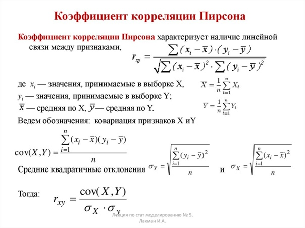

# Курсовой проект. Computer Vision Rangefinder

## Теория

Цель проекта с помощью двух камер определять расстояние до наведенного объекта. Сравнение изображений происходит спомощью
корреляции.

#### Корреляция



#### Метод определния расстояния до объекта

1. Одна камера должна прямо смотреть на объект, до которого определяем расстояние.
   После того как отведем камеру в сторону на расстоянии *Н*, образуется прямоугольный треугольник, где точка *А* объект,
   до которого определяем расстояние, точка *С* это камера находящаяся в одной плоскости с *А* и точка *В* камера
   отведенная на расстояние *Н*.
2. Делаем ряд пар снимков, с изменением оптического расстояния у камеры. У полученных пар мы вычисляем корреляцию.
   Выбираем минимальную, так как сравнение двух размытых снимков выдает результат равный ~1,
   имеет смысл брать ту пару у которой корреляция минимальна.
3. Необходима определить угол *АВС*, для этого с помощью метода *submatrix()* из снимка сделанного камерой *С* выводим
   центральный блок размерами *BLOCK_SIZE*. После чего проходим по снимку с камеры *B*,
   вычисляя с помощью корреляции наиболее похожий блок.
4. Зная координаты блока мы можем вычислить угол дальнего катета, который будет являться углом *ABC*, так как образуется
   параллелограмм. Треугольник на снимке будет прямоугольным. **При вычислении стоит учитывать оптическое искажение,
   экспериментально 60% от половины высоты снимка.**
5. Получив угол *ABC*, мы так же узнали угол *ВАС*, а *АСВ* *= 90 градусов*. Нам известна сторона *ВC* равная *Н*.
6. Тогда расстояние до объекта равно *AC = BC * tg(ABC)*.

## Сборка

1. **wiringPi** Если у вас нет утилиты git для работы с github-репозиториями, то устанавливаем:
   ```sh
   sudo apt-get install git-core
   ```
   Скачиваем исходники библиотеки из репозитория (Это библиотека сообщества)
   ```sh
   git clone https://github.com/WiringPi/WiringPi.git
   cd ./WiringPi
   ./build
   ```
2. **libjpeg**  *Эта бибилотека обезательна*
   ```sh
   sudo apt-get install libjpeg-dev
   sudo apt-get install libjpeg8-dev
   ```


